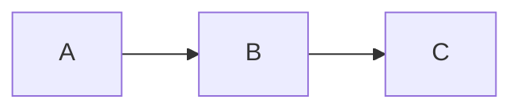

# Phase 2 Plan

Features designed but NOT implemented in Phase 1.

## WeChat Image Upload

Upload local images to WeChat CDN via the Material API.

```
WeChatImageUploader extends ImageUploader
  - authenticate(appId, appSecret) → accessToken
  - upload(localPath) → wechatCdnUrl
  - batchUpload(images[]) → urlMap
```

Requires:
- WeChat Official Account credentials (appId, appSecret)
- Material Management API access
- Token refresh handling
- Rate limiting

## WeChat Draft-Box API

Push compiled articles directly to the WeChat draft box.

```
WeChatPublisher
  - createDraft(article) → mediaId
  - updateDraft(mediaId, article)
  - getDraft(mediaId) → article
```

Article metadata:
- title
- digest (summary)
- cover image (thumb_media_id)
- author
- content (compiled HTML)
- content_source_url

## S3/R2 Image Upload

Alternative image hosting on cloud storage.

```
S3Uploader extends ImageUploader
  - configure(bucket, region, credentials)
  - upload(localPath) → publicUrl

R2Uploader extends ImageUploader
  - configure(accountId, bucket, credentials)
  - upload(localPath) → publicUrl
```

## Math SVG Rendering

If KaTeX HTML proves unreliable on WeChat, add SVG rendering:

```
MathNode
  renderedSvg = MathJax.tex2svg(sourceLatex)
  or
  renderedSvg = sharp(katex.renderToString(...)) → SVG/PNG
```

The platform adapter would choose HTML or SVG based on target requirements.

## Zhihu Draft Automation

Push articles to Zhihu via its API (if available).

```
ZhihuPublisher
  - authenticate(token)
  - createDraft(article) → draftId
  - updateDraft(draftId, article)
```

## Batch Compilation

Compile multiple articles at once:

```bash
publisher batch build articles/ --target wechat --theme default
publisher batch validate articles/ --target wechat
```

## Article Manifest Files

YAML/JSON manifest for article metadata:

```yaml
# article.manifest.yml
title: "从贝叶斯推断到变分推断"
author: "Author Name"
cover: images/cover.png
digest: "本文介绍变分推断的基本思想..."
tags:
  - 机器学习
  - 贝叶斯
theme: academic-orange
target: wechat
```

The compiler would read the manifest alongside the markdown source.

## Additional Themes

- Curate a collection of themes from the mdnice community
- Dark theme for Zhihu dark mode
- Conference paper style
- Textbook style
- Minimal style

## Diagram Support

Add Mermaid and/or PlantUML rendering:

```markdown


Render to SVG for platform compatibility (following doocs/md's approach).

## Custom Markdown Extensions

- GitHub-style callouts (`[!NOTE]`, `[!WARNING]`)
- Definition lists
- Ruby annotations
- Image sizing syntax
- Table of contents generation
